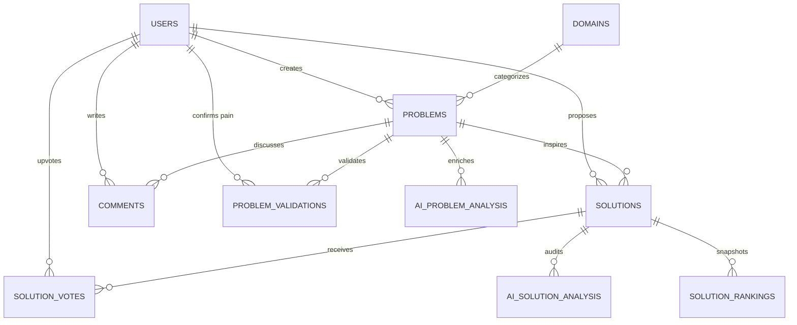

# PainPoint Architecture Specification

**Product**: Problem Discovery & Solution Community Platform  
**Positioning**: *"Real Problems. Real People. Better Solutions."*  
**Date**: September 2026 (Stage 0 Audit & Blueprint)

---

## 1. Stack Audit: Current vs. Target

| Layer | Current Development Baseline | Production Target Specification | Notes / Compatibility |
| :--- | :--- | :--- | :--- |
| **Backend Framework** | Laravel 12.69.2 | **Laravel 13.x** | Laravel 13 released March 17, 2026 (Security fixes through March 2028). Local environment uses PHP 8.2.12; production targets PHP 8.3/8.4+. |
| **PHP Runtime** | PHP 8.2.12 (CLI) | **PHP 8.3+ / 8.4** | Clean PSR-4 namespaces, typed properties, readonly classes. |
| **Frontend Bridge** | Inertia.js 3.7.1 (`@inertiajs/react`) | **Inertia.js + React 19** | Zero API duplication; instant SPA transitions; server-driven props. |
| **Frontend Framework** | React 19.3.0 (`react`, `react-dom`) | **React 19.3+** | React 19 concurrent features, TypeScript 7.0+, JSX transform. |
| **Styling Engine** | Tailwind CSS 4.0.0 via `@tailwindcss/vite` | **Tailwind CSS 4.x** | CSS-first `@theme` design tokens; no bloated tailwind.config legacy files. |
| **Icons & Motion** | Lucide React 1.47, Framer Motion 13.4 | **Lucide + Framer Motion** | Subtle micro-interactions, hardware-accelerated transforms. |
| **Database** | SQLite (dev baseline) / MySQL (XAMPP installed) | **MySQL 8.0+ / 8.4 LTS** | InnoDB, UUID/ULID primary keys, foreign key constraints, composite indexes. |
| **Cache & Queues** | Laravel Sync / Database Queue | **Redis 7.x + Horizon** | Async jobs for AI classification, ranking recalculations, notifications. |
| **AI Integration** | `AIProviderInterface` abstraction | **OpenAI + Claude + Gemini** | Isolated provider adapters, versioned prompt/analysis snapshots. |

---

## 2. Existing Functionality Baseline

1. **Working Routes & Pages**:
   - `/`: Homepage with Hero, live statistics banner, trending problems feed, domain catalog, Top 3 podium, 4-step "How It Works" methodology, and CTA banner.
   - Built and bundled via Vite 7 + `@tailwindcss/vite` without errors.
   - `HTTP 200` verified by automated tests and browser session on Desktop (`1280x800`) and Mobile (`390x844`).
2. **Foundational Components**:
   - `Navbar`: Sticky responsive header, live search, route navigation, auth modal trigger, mobile slide-over.
   - `MobileNav`: Fixed mobile bottom bar with elevated floating `+ Create` button.
   - `ProblemCard`: Standardized card with category tags, validation progress meter (`████████░░ 95%`), activity counters, and trending flame badge.
   - `SolutionCard`: Proposal cards with author reputation, implementation types (SaaS, Mobile App, AI, Process), upvoting, and AI problem-fit signals.
   - `TopSolutionCard`: Ranked podium cards (🥇 #1, 🥈 #2, 🥉 #3) with validation breakdown and AI relevance match.
   - `DomainCard`: Topic cards across 8 initial domains with icons, problem counts, and trending status.
   - `ValidationCard`: "Is this your problem too?" interactive validator with 1–5 pain scale and frequency breakdown.
   - `AuthModal`: Contextual login/register modal welcoming visitors upon clicking interactive actions without abrupt page redirects.
3. **Automated Test Baseline**:
   - Unit & Feature tests in `tests/` pass with 100% success rate.

---

## 3. Proposed Domain-Driven Backend Architecture

To ensure enterprise maintainability and prevent controller bloat, backend business logic is organized into bounded domain modules under `app/Domain/`:

```
app/
├── Domain/
│   ├── Problems/
│   │   ├── ProblemRepositoryInterface.php
│   │   ├── ProblemCreationService.php
│   │   └── DTOs/
│   ├── Solutions/
│   │   ├── SolutionRepositoryInterface.php
│   │   └── SolutionProposalService.php
│   ├── Conversations/
│   │   ├── CommentService.php
│   │   └── NestedThreadBuilder.php
│   ├── Validation/
│   │   ├── ValidationServiceInterface.php
│   │   └── ValidationAggregator.php
│   ├── Ranking/
│   │   ├── RankingServiceInterface.php
│   │   ├── RankingScorer.php
│   │   └── RankingSnapshotter.php
│   ├── AI/
│   │   ├── AIProviderInterface.php
│   │   ├── Providers/
│   │   │   ├── OpenAIProvider.php
│   │   │   ├── ClaudeProvider.php
│   │   │   └── GeminiProvider.php
│   │   ├── Services/
│   │   │   ├── ProblemClassificationService.php
│   │   │   ├── DuplicateDetectionService.php
│   │   │   └── SolutionAnalysisService.php
│   ├── Reputation/
│   │   ├── ReputationServiceInterface.php
│   │   └── BadgeCalculator.php
│   ├── Moderation/
│   │   ├── ModerationServiceInterface.php
│   │   └── ContentAuditLogger.php
│   └── Billing/
│       ├── BillingServiceInterface.php
│       └── EntitlementPolicy.php
├── Http/
│   ├── Controllers/
│   ├── Requests/
│   └── Resources/
├── Models/
├── Jobs/
│   ├── AnalyzeProblemJob.php
│   ├── AnalyzeSolutionJob.php
│   ├── DetectDuplicateProblemJob.php
│   └── RecalculateSolutionRankingJob.php
├── Events/
│   ├── ProblemCreated.php
│   ├── ProblemValidated.php
│   ├── SolutionCreated.php
│   └── TopSolutionPromoted.php
├── Listeners/
└── Policies/
```

---

## 4. Relational Database Architecture (MySQL)



### Key Tables & Indexing
- **`users`**: `id`, `name`, `email`, `role`, `reputation`, `avatar_url`, timestamps.
- **`domains`**: `id`, `slug` (unique index), `name`, `description`, `icon`, `problems_count`, `is_trending`.
- **`problems`**: `id` (ULID/bigint), `slug` (unique index), `domain_id` (foreign key), `category`, `title`, `summary`, `description`, `author_id`, `status` (indexed), `affected_count`, `solutions_count`, `discussions_count`, `views_count`, `is_trending`, timestamps.
  - *Indexes*: `[status, created_at]`, `[domain_id, is_trending]`, `[slug]`.
- **`problem_validations`**: `id`, `problem_id`, `user_id`, `vote` ('yes'|'no'), `frequency` ('daily'|'weekly'|'monthly'|'rarely'), `pain_level` (1-5), `created_at`.
  - *Constraint*: `UNIQUE(problem_id, user_id)` (prevents duplicate voting).
- **`solutions`**: `id`, `problem_id`, `author_id`, `slug`, `title`, `summary`, `description`, `solution_type`, `votes_count`, `helpful_votes_count`, `comments_count`, `rank` (nullable 1-3), `created_at`.
  - *Indexes*: `[problem_id, rank]`, `[problem_id, votes_count]`.
- **`solution_rankings`**: `id`, `solution_id`, `problem_id`, `score`, `rank`, `snapshot_version`, `created_at`.
- **`comments`**: `id`, `problem_id`, `author_id`, `parent_id` (self-referencing nullable foreign key for replies), `content`, `helpful_votes_count`, timestamps.
- **`ai_problem_analysis`**: `id`, `problem_id`, `provider`, `model`, `prompt_version`, `summary`, `audience`, `suggested_tags`, `duplicate_candidates_json`, timestamps.
- **`ai_solution_analysis`**: `id`, `solution_id`, `provider`, `model`, `analysis_version`, `problem_fit_score`, `fit_analysis`, `implementation_complexity`, `potential_impact`, timestamps.

---

## 5. Frontend Architecture (React 19 + Inertia + Tailwind 4)

```
resources/js/
├── Components/
│   ├── UI/                  # Button, Badge, Modal, Input, Textarea, Dropdown, Skeleton
│   ├── Layout/              # Navbar, MobileNav, Footer, AppLayout
│   ├── Problems/            # ProblemCard, ProblemHeader, ProblemStats, ProblemWizard
│   ├── Solutions/           # SolutionCard, TopSolutionCard, SolutionComposer
│   ├── Conversation/        # ConversationThread, CommentItem, ReplyBox
│   ├── Validation/          # ValidationCard, PainMeter, FrequencyChart
│   └── Domains/             # DomainCard, DomainHeader
├── Pages/
│   ├── Home.tsx             # Landing experience & high-velocity discovery
│   ├── Explore.tsx          # Full problem directory with multi-faceted filtering
│   ├── Trending.tsx         # Trending velocity dashboard
│   ├── Domains/
│   │   ├── Index.tsx        # All domains grid
│   │   └── Show.tsx         # Domain-filtered problem collection
│   ├── Problems/
│   │   ├── Show.tsx         # Core Product Unit (Problem Detail + Top 3 + Conversation)
│   │   └── Create.tsx       # Conversational 5-step problem creation wizard
│   ├── Solutions/
│   │   ├── Index.tsx        # Community solutions directory
│   │   └── Show.tsx         # Deep-dive solution detail
│   └── Pricing.tsx          # Tier comparison (Free, Pro, Founder, Business)
├── data/
│   └── mockData.ts          # Realistic seed dataset (30+ problems across 8 domains)
└── types/
    └── index.ts             # Strict TypeScript definitions
```

---

## 6. AI & Deterministic Ranking Engine Architecture

### Fundamental Principle
**AI does NOT decide the winner.**  
AI produces structured, versioned analysis signals. The `RankingService` uses a strictly deterministic formula:

$$\text{RankScore} = w_v \cdot \text{NormalizedVotes} + w_p \cdot \text{ValidationAgreement} + w_h \cdot \text{HelpfulRatio} + w_d \cdot \text{DiscussionDepth} + w_r \cdot \text{RecencyDecay} + w_a \cdot \text{VersionedAISignal}$$

### Auditable Ranking Characteristics
1. **Configurable Weights**: Admin-controlled weighting in configuration.
2. **Deterministic Tie-Breakers**: `Score` → `HelpfulVotes` → `ValidationRate` → `ID ASC`.
3. **Reproducibility**: Stored ranking snapshots guarantee that Top 3 pinning can be audited historically.
4. **Resilience**: If the external AI API is delayed or fails, community ranking proceeds without interruption ($w_a = 0$).

---

## 7. Security & Authorization Architecture

- **Session Authentication**: Secure HTTP-only cookie sessions with CSRF tokens.
- **Contextual Auth Gate**: Unauthenticated users can read all public problems, discussions, and solutions. When attempting restricted mutations (vote, validate, comment, follow, save, publish), the `AuthModal` is triggered contextually.
- **Resource Ownership**: Laravel Policies (`ProblemPolicy`, `SolutionPolicy`, `CommentPolicy`) enforce that users can only edit or delete their own contributions.
- **Moderation & Reporting**: Any member can flag content (`spam`, `abuse`, `misleading`, `duplicate`). Admin actions are recorded with audit trails.
- **Data Protection**: Zero raw AI API keys or payment gateway secrets are exposed to client JavaScript.

---

## 8. Performance Strategy

- **Inertia Client-Side Transitions**: Zero full-browser reloads after initial load.
- **Tailwind 4 Pre-Compiled CSS**: `@tailwindcss/vite` generates minimal CSS with modern CSS variable tokens.
- **Asynchronous Heavy Processing**: AI analysis and ranking recalculation run inside background queues.
- **Cursor & Offset Pagination**: Discussions and solutions are paginated (10-15 items per page) to prevent DOM bloat on high-activity problems.
- **Database Eager Loading**: Eloquent queries explicitly eager-load `author`, `domain`, and `validation` relations to eliminate N+1 queries.
